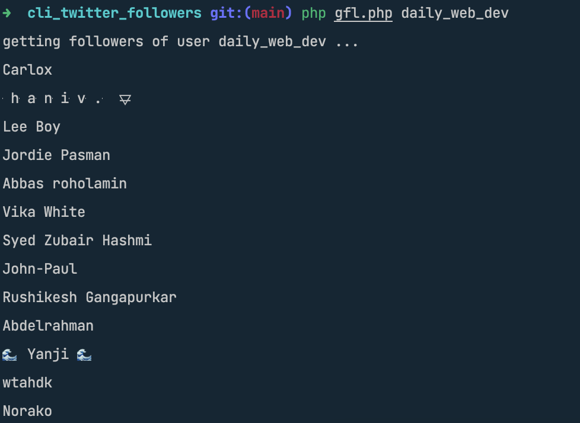

Simple app that prints the names of the twitter followers of the given account, using a .csv file to store pagination tokens.  

To obtain api keys, go to the https://developer.twitter.com/en/portal/dashboard and press Add App.

Usage: `php gfl.php daily_web_dev`